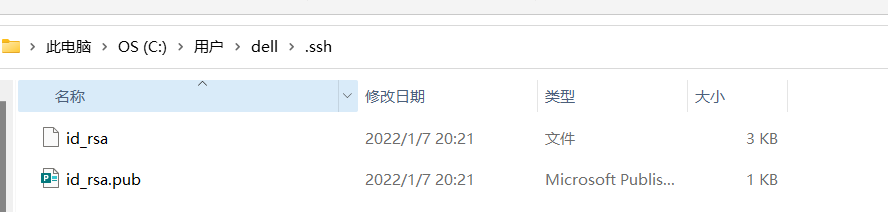
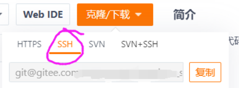

# Git的使用教程
- 我使用的是github desktop 一键部署完成
- 此教程为gitee使用者准备
## 其一，ssh登录
- 看到这一步肯定是都已经安装好了 直接来
- 打开文件夹:C:\Users\用户名.ssh

如果有这个文件夹 就说明生成成功了。直接复制粘贴内容到gitee个人用户中的ssh公钥里
- 如果没有
~~~
git config --global user.name "用户名（gitee的用户名）"
git config --global user.email "邮箱（gitee邮箱）"
~~~
- 然后再用这个命令查看是否生成成功
~~~
git config --list
~~~
如果生成的下列内能找到对应的user.name和user.email就算成功了。

- 然后生成你的密钥
~~~
ssh-keygen -t rsa -C "(这里填写邮箱)"
~~~
- 生成后重复上面的找密钥的操作即可。

## 其二，初始化git仓库.
大家已经创建过gitee仓库了，接下来是在本地链接
- 在你需要做git仓库的文件夹shift右键选择 在终端打开
~~~
git init .
~~~
- 复制这里的内容

- 然后创建你的远程仓库
~~~
git remote add origin <你的项目地址>
~~~
-剩下的就是基本的git命令了 这一部分百度即可。