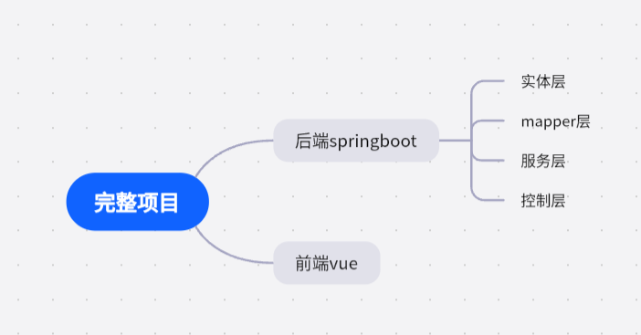

# 课设流程简述
很多同学还不知道课设应该如何完成 甚至无从下手

给大家一份流程顺序图。
- like this

我们的从头开始做应当是 从浅入深。
- 实体层

    用于实现各种不同实体：例如用户之类的
- mapper层（dao层）

    通过这一部分对上一部分进行增删改查，具体可以通过自学mybatis来完成
- 服务层

    来实现各种实际的操作比如 登录and so on
- 控制层

    用于前后端进行联系
# 别先盯着你那个vue看了！